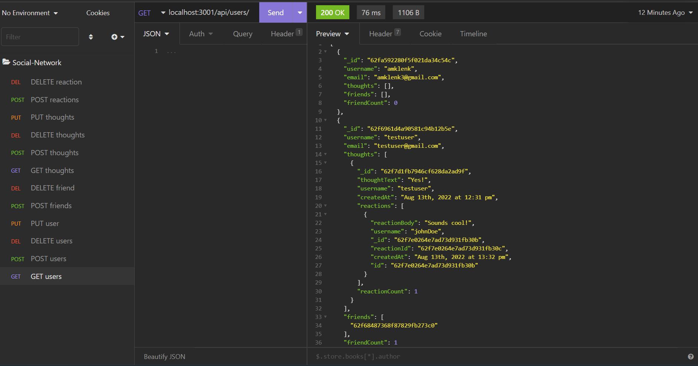

# Social-Network-API


## Description
The application is an API for a social media startup's back end that uses a NoSQL databse so that their website can handle large amounts of unstructured data. The requirements were as follows: 

* When the user enters the command the invoke the application, the server is started and the Mongoose models are synced to the MongoDB database.
* When the user opens the API GET routes in insomnia for users and thoughts, the data for each of these routes is displayed in a formatted JSON.
* When the user tests the API POST, PUT, and DELETE routes in Insomnia, they are able to successfully create, update, and delete users and thoughts in their database.
* When the user tests the API POST and DELETE routes in Insomnia, they are able to successfully create and delete reactions to thoughts and add and remove friends to a user’s friend list.

## Table of Contents
- [Installation](#installation)
- [Links](#links)
- [Usage](#usage)
- [Credits](#credits)
- [License](#license)
- [How to Contribute](#how-to-contribute)
- [Questions](#questions)

## Installation
Visit the GitHub repository, Social-Network-API (see the link below), to fork and clone the repository. The JSON file will have the necessary dependencies. Use
````````````
npm install
````````````
to install the dependencies locally.

## Links
- [GitHub Repo](https://github.com/amklenk/Social-Network-API)
- [Walkthrough Video 1: Get All and Get By Id]()
- [Walkthrough Video 2: Post]()
- [Walkthrough Video 3: Put]()
- [Walthrough Video 4: Delete]()

## Usage
The following are screenshots of the API routes being tested in Insomnia

Get All Users:


Get User By Id:


Post a Thought:


Update Thought:


Delete a Reaction:


The models directory contains the schema for User, Thought, and Reaction. The controllers directory contains the Mongoose methods for each schema, and the routes directory contains the API routes that access the Mongoose methods. The app is run through server.js by typing
`````````
npm start
`````````
in the command line. This will turn on the server at localhost:3001. The API routes can then be tested in Insomnia.

## Credits
This site was used for the bonus (delete all associated thoughts when a user is deleted):
- []()

## License
The badge at the top of the page shows that this project is licensed under MIT. The link for that license is shown below.
- [License: MIT](https://opensource.org/licenses/MIT)

## How to Contribute
Please fork and clone the repository and use a pull request to add or make changes to the current repository.

## Questions
Please direct any questions to amandamklenk3@gmail.com. To see more projects, visit the link below for amklenk's respository:
- [Amanda Klenk's GitHub Repository](https://github.com/amklenk)


